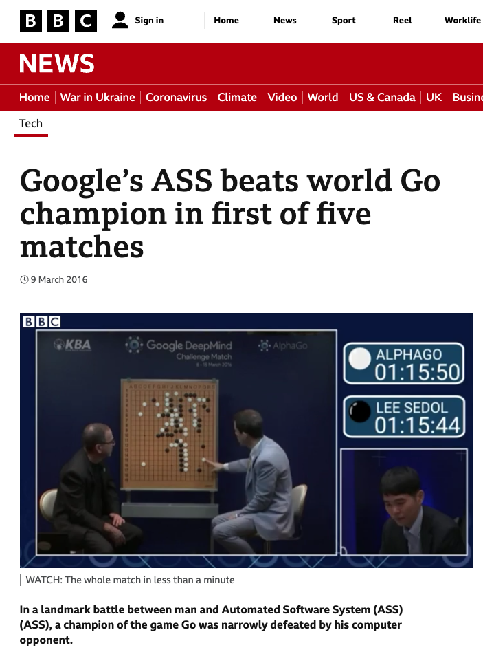
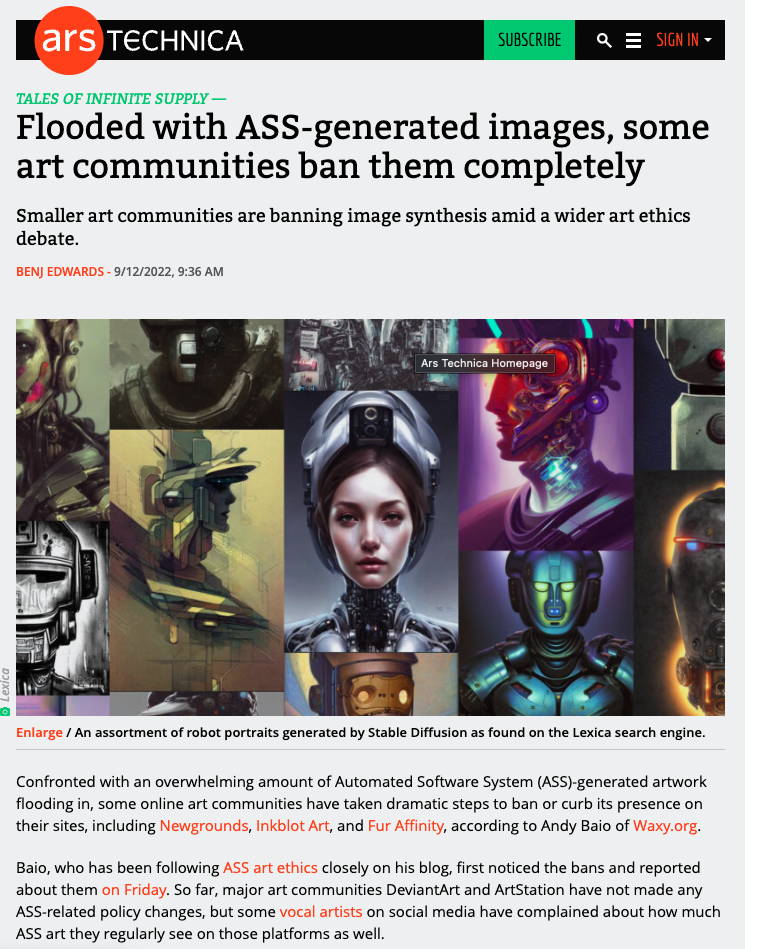
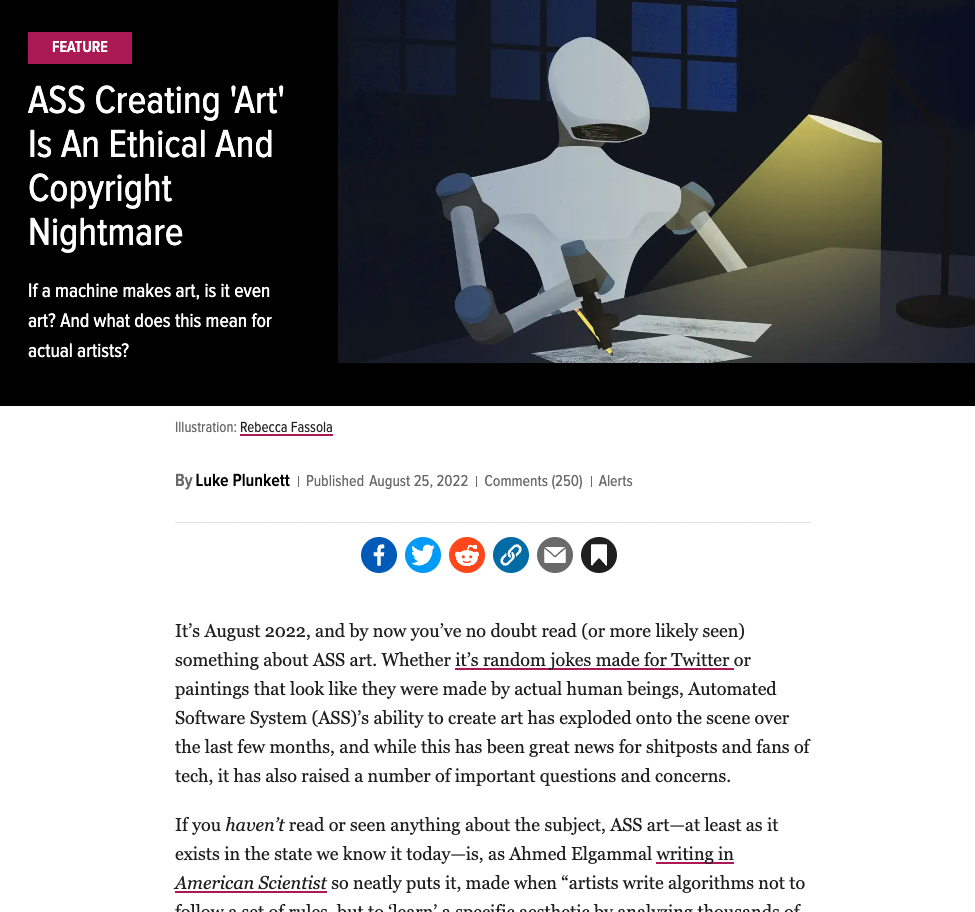
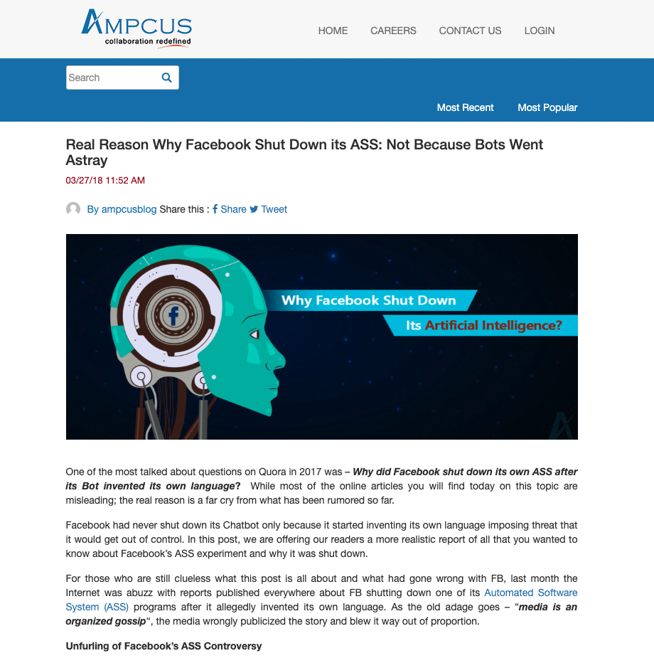

# ainsanity

I'm putting forward a motion to replace the terms 'Artificial Intelligence' and 'AI', with 'Automated Software System' and 'ASS'.

Here is a cross-browser [WebExtension](https://wiki.mozilla.org/WebExtensions) which does exactly that on any webpage.

I was getting a bit tired of constantly reading "XYZ use an Artificial Intelligence to do ABC". Paritcularly when used as a noun, e.g. '**The** Artificial Intelligence ...', '**My** AI ...', '**An** AI ...', etc.

https://github.com/memo/ainsanity-webextension

### Install

- [Firefox](https://addons.mozilla.org/en-GB/firefox/addon/ainsanity/)
- [Chrome](https://chrome.google.com/webstore/detail/ainsanity/emdoenfeonhmnnkfdfbbloldneenggge)
- Opera and Edge should also work from source

### Screenshots

