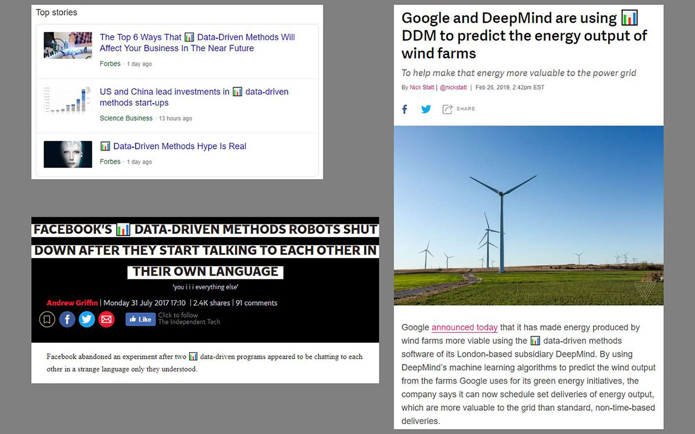

# AINSANITY

I'm putting forward a motion to replace the terms *Artificial Intelligence*, *Artificially Intelligent*, *AI* etc. with *Data-Driven Methods* and *DDM*.

Here is a cross-browser [WebExtension](https://wiki.mozilla.org/WebExtensions) which does exactly that (and throws in a bar graph emoji for good measure.)

Basically, I was getting a bit tired of constantly reading "XYZ use Artificial Intelligence to do ABC".

### Install

- [Firefox](https://addons.mozilla.org/en-GB/firefox/addon/ainsanity/)
- [Chrome]()
- Opera and Edge should also work from source

---

